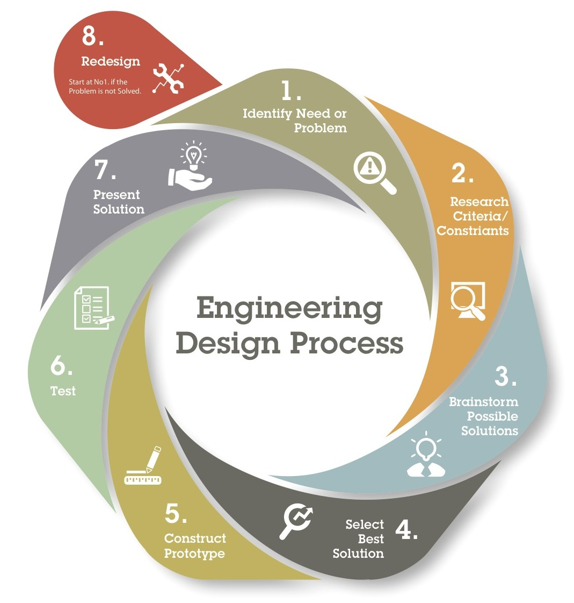
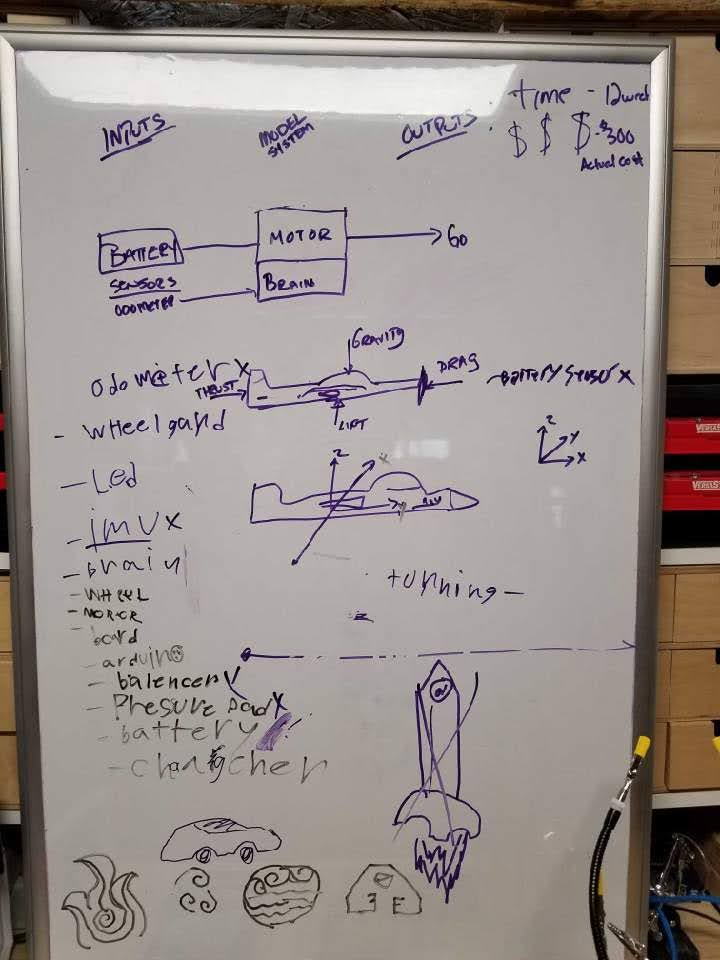
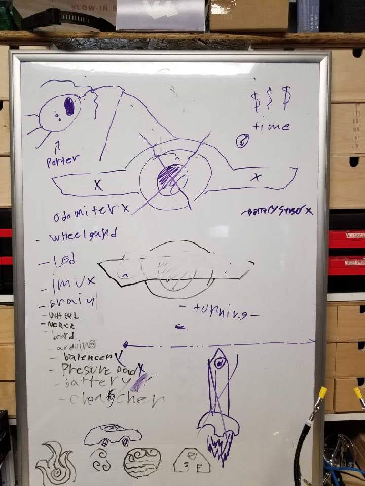
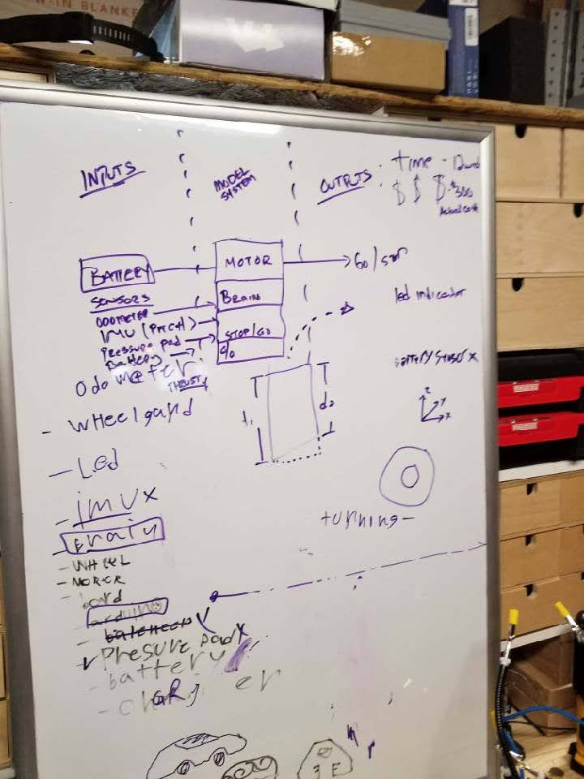

<!-- .slide: data-background="./Images/header.svg" data-background-repeat="none" data-background-size="40% 40%" data-background-position="center 10%" class="header" -->
# Project Overview

<!-- Put a link to the slides so that students can find them -->

<!--➡️ [**Slides**](/gunterBotsEngineeringCourse/Slides/Lesson2.html ':ignore') -->

Use the Engineering/Problem Solving Cycle to Solve your problems.
1. Identify Need or Problem
   moving without walking or pushing off with your foot.
   The problem -  don't have a one Wheel!  

1. Research Criteria/Constraints
   Limited Funds ($300ish per person), limited time - 12 weeks max
   
1. Brainstorm possible solutions
   Build one from parts, pieces, etc.

<!-- > -->